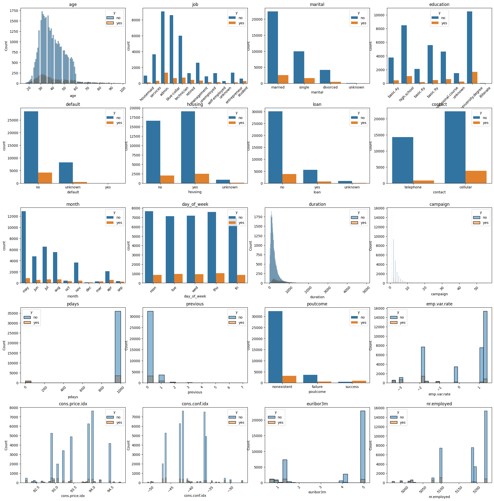
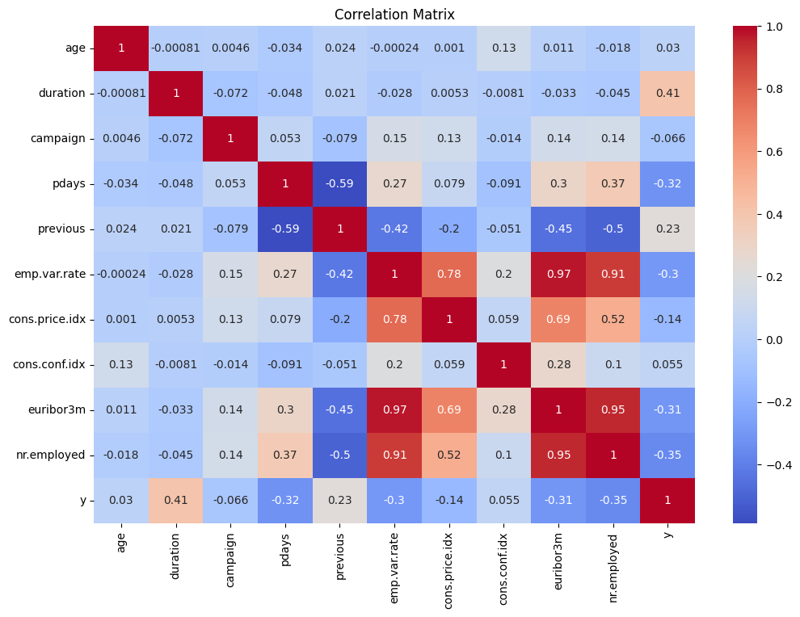
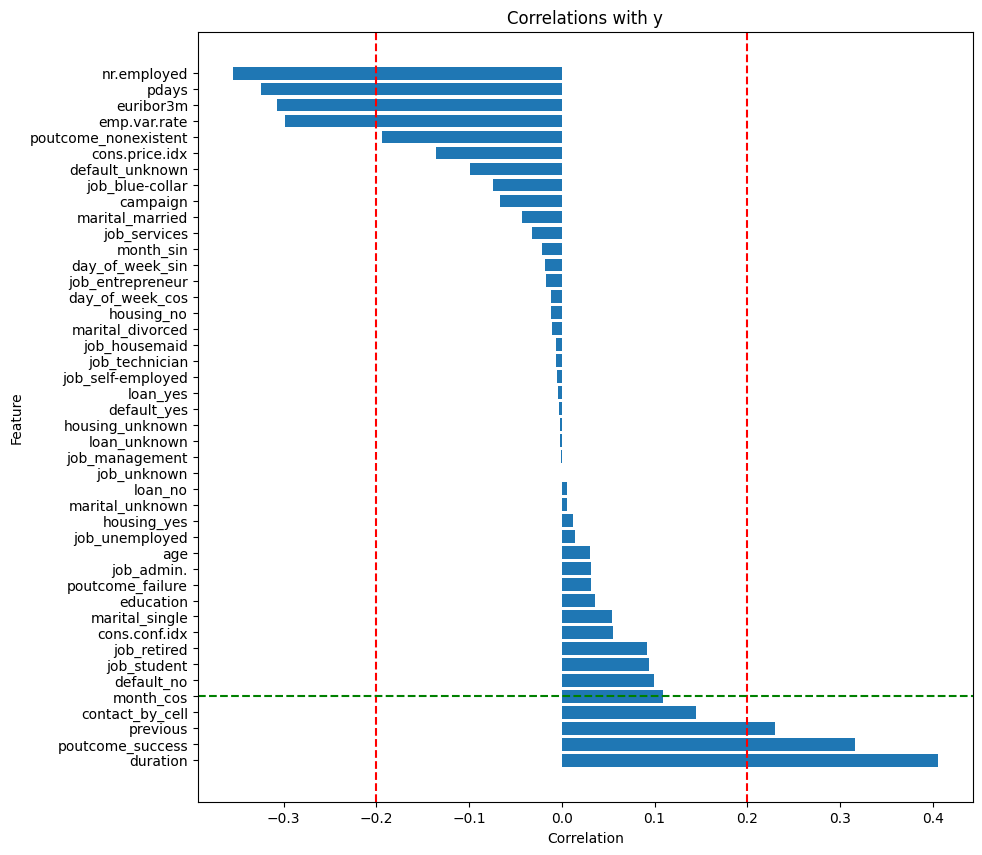
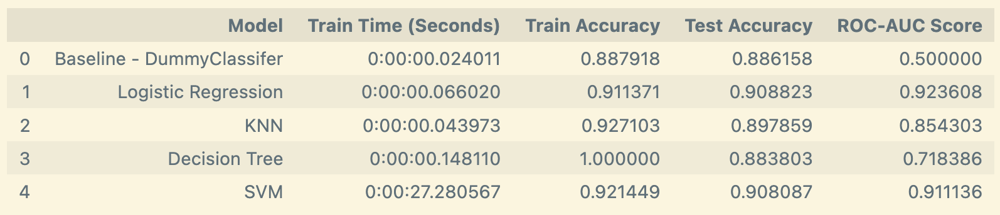
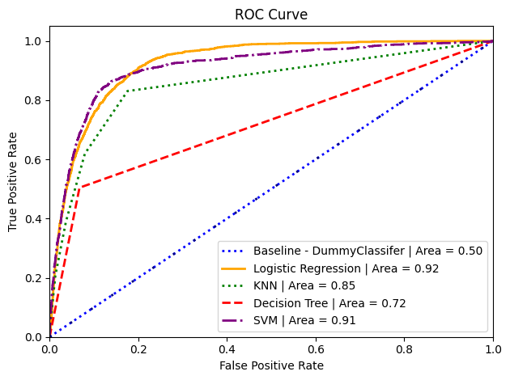
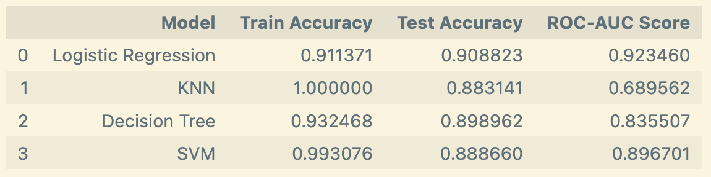
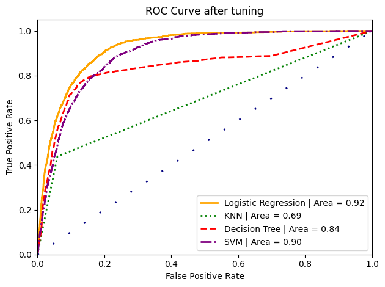
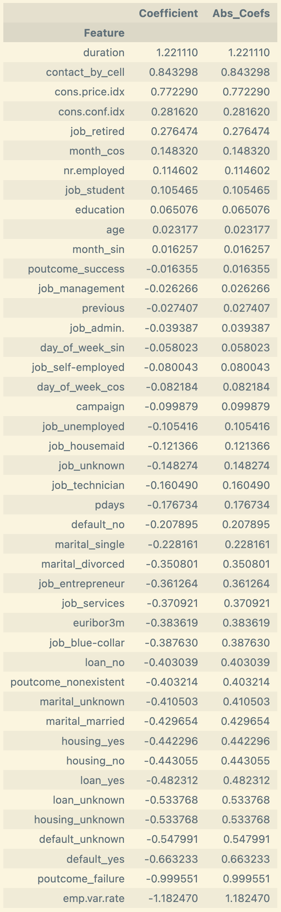
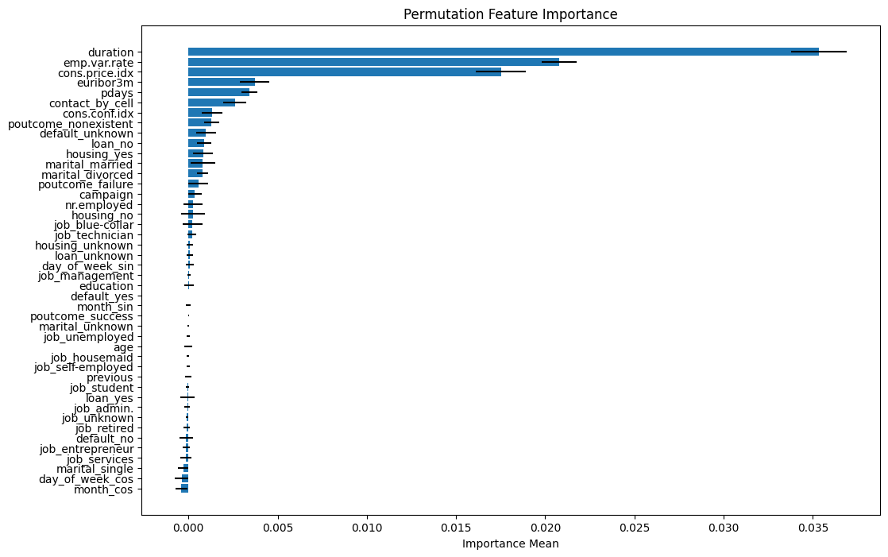

# Comparing the Performance of Different Classifier Models for Direct Marketing Campaigns

The banking industry is facing pressure from regulatory changes and market competition, driving demand for more efficient and effective marketing strategies.  With the increasing importance of direct marketing as a key channel for customer acquisition, a bank needs a data-driven approach to optimize its campaigns and improve its return on investment (ROI).

## Project Overview

This project uses a dataset containing results of multiple marketing campaigns from a Portuguese banking institution. [(see UCI ML repo)](https://archive.ics.uci.edu/dataset/222/bank+marketing)

By building and evaluating a number of classifier models, we will attempt to identify the most important features that influence a prospect’s likelihood of subscribing to a deposit product.  This insight will help us optimize direct marketing campaigns, reducing costs while increasing conversions.

## Exploratory Data Analysis
Per the [S. Moro, RMS Laureano et al. published paper](https://core.ac.uk/download/pdf/55616194.pdf), this dataset is mostly cleaned.  Only a dozen duplicate rows needed to be dropped.

The popular [ydata-profiling](https://docs.profiling.ydata.ai/latest/) package was used to produce a [statistical report](https://html-preview.github.io/?url=https://github.com/dmtrinh/direct-marketing-campaigns/blob/main/resources/data_profile_report.html) of the dataset.

By plotting the number of samples for each predictor variable with the target variable as the hue, it's clear we are dealing with a highly imbalanced dataset.

## Data Preparation

* `job`, `marital`, `default`, `housing`, `loan`, and `poutcome` variables had `unknown` or `nonexistent` values.  From the above plot, notice that the missing values relationship with the target variable is quite different than other values.  This missingness is informative and therefore we chose not to impute the missing values.  One-hot encoding was used for these variables.
* `education` had a natural order so ordinal encoding was used on this variable.  The value mapping is as follows:  `unknown`: 0, `basic.4y`: 1, `basic.6y`: 2, `basic.9y`: 3, `high.school`: 4, `professional.course`: 5, `university.degree`: 6
* `contact` only had two values: `cellular` and `telephone`.  This was binary encoded into `contact_by_cell` with 1 indicating the communication type was cellular and 0 to be telephone (non-cellular).
* Both `month` and `day_of_week` required special treatment since it's desirable to retain continuity and also avoid misleading distances between values.  For example, December of last year is only 1 month away from January of this year.  A naive ordinal encoding would have lead to a delta of 11 between these two months.  Cyclical encoding was used on these variables.[[ref]](https://towardsdatascience.com/cyclical-encoding-an-alternative-to-one-hot-encoding-for-time-series-features-4db46248ebba)

Once non-numerical columns were properly encoded, we recomputed the correlation matrix.  Correlations of the new variables against the target 'y':

## Modeling

For the baseline, a dummy classifier with the `most_frequent` strategy was used.  Given the significant class imbalance, this represents the worst-case scenario.

Pipelines were created for Logistic Regression, KNN, Decision Tree, and Support Vector Machine (SVM) models.  Each pipeline had a `StandardScaler` applied to the following variables:  [`age`, `education`, `duration`, `campaign`, `pdays`, `previous`, `emp.var.rate`, `cons.price.idx`, `cons.conf.idx`, `euribor3m`, `nr.employed`]

Here's how the models performed:

Surprisingly, Logistic Regression performed best, followed closely by SVM.  SVM results were particularly unimpressive when taking training and inference time into account.

KNN came in close behind with respectable performance across the board.  In last place was the Decision Tree model; due to overfitting, it performed even worst than the baseline, despite obtaining 100% training accuracy.

### Tuning
To see if further performance can be extracted from these models, we turned to tuning hyperparameters for each model.  `GridSearchCV` was used to help find the optimal values for each model's hyperparameters.

Our models' performance after tuning:

### Feature Importance
To identify features with the largest contribution to a model's statistical performance we examined the coefficients of the fitted model.  

In addition, `permutation_importance` from [sklearn](https://scikit-learn.org/stable/modules/generated/sklearn.inspection.permutation_importance.html) was used to cross-check our results.  `permutation_importance` works by randomly shuffling the values of a single feature and observing the resulting degradation of the model's score.

We focused only on the Logistic Regression model as it was the best performing model.

## Findings & Recommendations

Based on our analysis, the most important features affecting client subscriptions are:
* duration
* contact
* cons.price.idx
* cons.conf.idx

Clients who are retired appear to also respond well to the marketing campaigns.  Retirees tend to be more risk adverse and will benefit from the stable returns offered by a deposit product.

Month of year is another potential predictor.  March, April, Sept, Oct, and December have the highest campaign success rates.  Banks can reduce the amount of marketing during the summer months to save costs.

